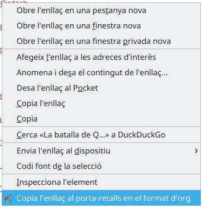

<p align="center">
  <a href="http://www.gnu.org/licenses/gpl-3.0.txt" rel="nofollow"></a>
</p>

---

Simple browser extension that allows users to copy page links into the clipboard while transforming them into the [org mode](https://orgmode.org/) format. This is done by adding a new item on the context menu of links, as shown on the following picture:

<p align="center">
  <a target="_blank" rel="noopener noreferrer" href="./doc/demo.png">
    
  </a>
</p>

As you can see, this has been localized. If you are missing a language, feel free to [contribute with a translation](./CONTRIBUTING.org).

### Known issues

It does not work for Google Chrome. I first wrote this extension on Firefox, since this is the browser I use. That being said, then I noticed that it does not work for Chrome at all. First of all, it doesn't like the [Clipboard API](https://developer.mozilla.org/en-US/docs/Web/API/Clipboard_API), which is a bummer since the equivalent code is quite ugly. But more importantly, and stupidly enough, I don't seem to be able to fetch the text of the selected link (which sounds really stupid and dead easy in other JS contexts). If you know how to do this, please send me a [pull request](./CONTRIBUTING.org).

## Contributing

Do you want to contribute with code, or to report an issue you are facing? Read
the [CONTRIBUTING.org](./CONTRIBUTING.org) file.

## [Changelog](https://pbs.twimg.com/media/DJDYCcLXcAA_eIo?format=jpg&name=small)

Read the [CHANGELOG.org](./CHANGELOG.org) file.

## License

```txt
Copyright (C) 2020 Miquel Sabaté Solà <mikisabate@gmail.com>

This program is free software: you can redistribute it and/or modify
it under the terms of the GNU General Public License as published by
the Free Software Foundation, either version 3 of the License, or
(at your option) any later version.

This program is distributed in the hope that it will be useful,
but WITHOUT ANY WARRANTY; without even the implied warranty of
MERCHANTABILITY or FITNESS FOR A PARTICULAR PURPOSE.  See the
GNU General Public License for more details.

You should have received a copy of the GNU General Public License
along with this program.  If not, see <http://www.gnu.org/licenses/>.
```
